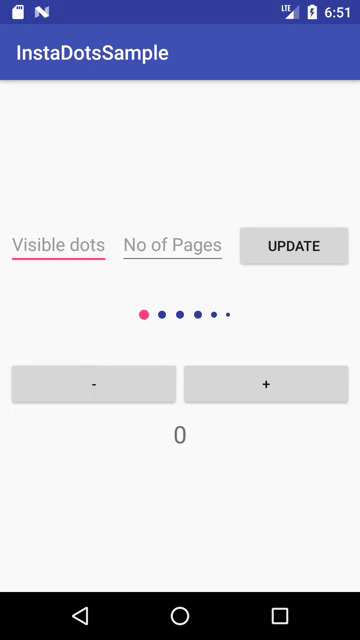

# InstaDot 
[]( https://android-arsenal.com/details/1/6348 )
[](https://android-arsenal.com/api?level=10) 
[](http://www.apache.org/licenses/LICENSE-2.0.html)

Instagram like dot indicator standalone view. It can be used with any component

# Demo

 


_Note: Sample app is also included in the repo so you can check the code_


#  Usage:

Add `jitpack.io` in your root `build.gradle` :
```groovy
allprojects {
 repositories {
    maven { url "https://jitpack.io" }
 }
}
```
_Note:_ do not add the `jitpack.io` repository under `buildscript`

Add the `dependency` in your app `build.gradle` :
```groovy
dependencies {
    compile 'com.github.hrskrs:InstaDotView:1.0'
}
```

### In layout:

Add view with attributes of your choice

``` xml

      <com.hrskrs.instadotlib.InstaDotView
            android:layout_width="wrap_content"
            android:layout_height="wrap_content"
            app:dot_activeColor="@color/colorAccent"
            app:dot_activeSize="10dp"
            app:dot_inactiveColor="@color/colorPrimaryDark"
            app:dot_inactiveSize="8dp"
            app:dot_margin="10dp"
            app:dot_mediumSize="6dp"
            app:dot_smallSize="4dp" />
```


#### [REQUIRED] Set number of pages:

```java
    instadotViewInstance.setNoOfPages(int pages);
```


#### [OPTIONAL] Set number of visible items (it must be greater than Default value (6))

```java
    instadotViewInstance.setVisibleDotCounts(int pages);
```

#### Attributes for customization [If none set, all default values are used]:
``` xml
   <attr name="dot_activeColor" format="color" />
   <attr name="dot_inactiveColor" format="color" />
   <attr name="dot_activeSize" format="dimension" />
   <attr name="dot_inactiveSize" format="dimension" />
   <attr name="dot_mediumSize" format="dimension" />
   <attr name="dot_smallSize" format="dimension" />
   <attr name="dot_margin" format="dimension" />
   <attr name="dots_visible" format="integer" />
```


# License

    Copyright (C) 2017 Haris Krasniqi

    Licensed under the Apache License, Version 2.0 (the "License");
    you may not use this file except in compliance with the License.
    You may obtain a copy of the License at

         http://www.apache.org/licenses/LICENSE-2.0

    Unless required by applicable law or agreed to in writing, software
    distributed under the License is distributed on an "AS IS" BASIS,
    WITHOUT WARRANTIES OR CONDITIONS OF ANY KIND, either express or implied.
    See the License for the specific language governing permissions and
    limitations under the License.
